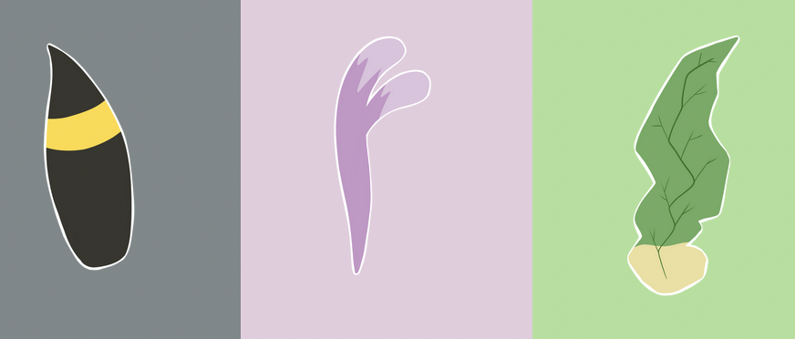

# Procesverslag
Markdown is een simpele manier om HTML te schrijven.  
Markdown cheat cheet: [Hulp bij het schrijven van Markdown](https://github.com/adam-p/markdown-here/wiki/Markdown-Cheatsheet).

Nb. De standaardstructuur en de spartaanse opmaak van de README.md zijn helemaal prima. Het gaat om de inhoud van je procesverslag. Besteedt de tijd voor pracht en praal aan je website.

Nb. Door *open* toe te voegen aan een *details* element kun je deze standaard open zetten. Fijn om dat steeds voor de relevante stuk(ken) te doen.

## Jij

### Ontwerper:
Gwyneth Schmitz

#### Je startniveau:
Mijn startniveau is: blauw

# Je plan

  
De eerste versie/schets van je ontwerp & je persoonlijke uitdaging

  ### De eerste versie/schets:
  
  
  
  

  ### Je ambitie: 
  Aan deze technieken/punten wil ik werken:
  - punt 1: Ik wil d.m.v. keyframes de staartjes laten wiebelen als je er overheen hovered.
  - punt 2: Ik wil het ontwerp schaalbaar maken.
  - Punt 3: Ik wil een overlay maken waar je de pokemon kaart met verdere info over de eeveelutions ziet.
  - ...
 

## Voortgang/Feedback 1

  
Mijn bevindingen + wijzigingen (minimaal 5)

  ### Bevinding 1:
  De informatie die ik had gevonden, over dat de eevee's level 15 moeten zijn voordat ze kunnen evolueren, klopt niet. Eevee hoeft niet perse level 15 te zijn, maar moet wel een hoge vriendschap met je vormen, de tijd van de dag maakt uit en de stenen die bepaalde evoluties kunnen sturen ook.

  #### oplossing:
De benodigdheden om eevee te evolueren weergeven in de interface. Dit wil ik doen bij de details over de desbetreffende eeveelution. Ik wil de focus meer op de kaart leggen en heb daarom mijn design iets aangepast met een verduidelijking wat er op de eevee kaart komt te staan. 

  ### Bevinding 2:
  Omschrijving van wat er nog niet orde was (tekst en afbeeding(en)).
  Er is nog geen verband tussen eevee en het evolueren naar een eeveelution.

  #### oplossing:
Ik zit er aan te denken een button te maken onder de interface waarmee je kan kiezen naar welke eevee je wilt evolueren.

  ### Bevinding 3:
  Ik wil pokemon kaarten tonen met meer info over de eeveelution. Zoals ik dat in mijn schetsen/1e ontwerp in adobe xd voor ogen zie. Echter staat er beschreven dat er maar één pagina gerealiseerd mag worden en zal ik dus moeten werken met een overlay.
  

  #### oplossing:
Een overlay maken met javascript.

  ### Bevinding 4:
De overlay werkt alleen op de eerste button. (javascript op de button was ook inline...)
  

  #### oplossing:
Ik heb het werkend weten te krijgen op iedere aparte button. Daarnaast is de inline javascript nu ook weg.

  ### Bevinding 5:
Op dit moment is enkel de button onder de staart klikbaar, maar de staart zelf nog niet.

  #### oplossing:
Ik wil dit oplossen door de staart te veranderen in een button, waardoor de button eronder dus verdwijnt. Of ik behoud de button, maar de staart is ook klikbaar.

## Voortgang/Feedback 2

  
Mijn bevindingen + wijzigingen (minimaal 5)

  
  ### Bevinding 1:
  Ik heb nog geen custom properties gebruikt, omdat ik ze niet geheel begreep.

  #### oplossing:
  Ik heb het nagevraagd aan een medestudent en begrijp nu wel hoe het werkt. Dit heb ik gelijk toegepast in mijn code:
  

  ### Bevinding 2:
  De staart wiggled enkel als je over de staart zelf hovered. Het zou leuk zijn als de staart wiggled als je over de balk hovered.
  

  #### oplossing:
  Ik wil dit oplossen door de animatie in het blok te zetten, waardoor de wiggle animatie getriggered wordt, zodra je over het blok hovered.
  

  ### Bevinding 3:
  De buttons hebben nog geen active state.

  #### oplossing:
  Ik ga een active state toevoegen aan de buttons.

  ### Bevinding 4:
  De buttons hebben nog geen hover state, de balk en staart wel.

  #### oplossing:
  Ik wil een hover state met kleurverloop aan de button toevoegen.

  ### Bevinding 4:
  De namen van classes, ID's en variabelen is niet geheel consistent. Ik switch soms tussen engels/nederlands.
    

  #### oplossing:
  Ik ga de naamgeving aanpassen naar 1 taal. 

## Voortgang/Feedback 3

  
Mijn bevindingen + wijzigingen (minimaal 5)

  
  ### Bevinding 1:
  Omschrijving van wat er nog niet orde was (tekst en afbeeding(en)).
  Als feedback heb ik gekregen dat het niet functioneel was om geen focus state om de buttons heen te hebben.
  

  #### oplossing:
  Beschrijving hoe je het hebt hebt opgelost of als het niet gelukt is hoe je het zou oplossen (tekst en afbeeding(en)).
  Ik heb dit opgelost door een box shadow op de focus state van de button te stylen. Specifiek een witte rand, aangezien dit matched met de witte rand om de eevee staarten.
  

  ### Bevinding 2:
  De witte rand om de Eevee staarten mag nog wel iets dikker, zodat deze meer matched met de box-shadow van de focus state van de knoppen.
    

  #### oplossing:
  Ik ga deze omlijning van de staarten dikker maken in Photoshop.

  ### Bevinding 3:
  ...

## Reflectie

  
Mijn eindresultaat & persoonlijke ontwikkeling

  ### Je uitkomst - karakteristiek screenshot(s):
  

  ### Dit ging goed/Heb ik geleerd: 
  Korte omschrijving met plaatje(s)

  

  ### Dit was lastig/Is niet gelukt:
  Korte omschrijving met plaatje(s)

  

## Bronnenlijst

continu bijhouden terwijl je werkt

Nb. Wees specifiek ('css-tricks' als bron is bijv. niet specifiek genoeg).

1. bron 1: VW & VH https://stackoverflow.com/questions/24808661/make-div-100-width-of-browser-window
2. bron 2: Flexbox https://css-tricks.com/snippets/css/a-guide-to-flexbox/
3. bron 3: CSS Animaties https://css-tricks.com/almanac/properties/a/animation/
4. bron 4: JS Overlay https://www.w3schools.com/howto/howto_css_overlay.asp
5. bron 5: Javascript event listener https://developer.mozilla.org/en-US/docs/Web/API/EventTarget/addEventListener
6. bron 6: Javascript functions https://www.w3schools.com/js/js_functions.asp
7. bron 7: Transform CSS https://developer.mozilla.org/en-US/docs/Web/CSS/transform-origin
8. bron 8: Gradient https://cssgradient.io/
9. bron 9: CSS Background position https://developer.mozilla.org/en-US/docs/Web/CSS/background-position-y
10. bron 10: Pokemon energy types https://imgur.com/a/jEwm0#HNv9RZi

