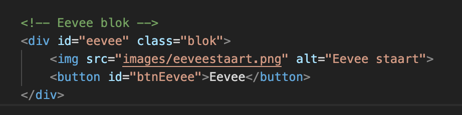
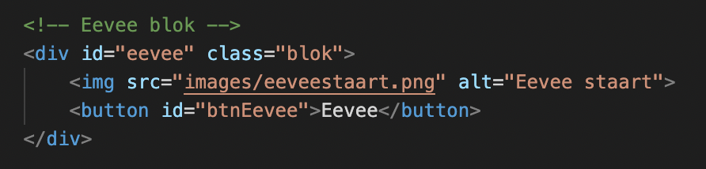

# Procesverslag
Markdown is een simpele manier om HTML te schrijven.  
Markdown cheat cheet: [Hulp bij het schrijven van Markdown](https://github.com/adam-p/markdown-here/wiki/Markdown-Cheatsheet).

Nb. De standaardstructuur en de spartaanse opmaak van de README.md zijn helemaal prima. Het gaat om de inhoud van je procesverslag. Besteedt de tijd voor pracht en praal aan je website.

Nb. Door *open* toe te voegen aan een *details* element kun je deze standaard open zetten. Fijn om dat steeds voor de relevante stuk(ken) te doen.

## Jij

### Ontwerper:
Gwyneth Schmitz

#### Je startniveau:
Mijn startniveau is: blauw

# Je plan

  
De eerste versie/schets van je ontwerp & je persoonlijke uitdaging

  ### De eerste versie/schets:
  
  
  
  

  ### Je ambitie: 
  Aan deze technieken/punten wil ik werken:
  - punt 1: Ik wil d.m.v. keyframes de staartjes laten wiebelen als je er overheen hovered.
  - punt 2: Ik wil het ontwerp schaalbaar maken.
  - Punt 3: Ik wil een overlay maken waar je de pokemon kaart met verdere info over de eeveelutions ziet.
  - ...
 

## Voortgang/Feedback 1

  
Mijn bevindingen + wijzigingen (minimaal 5)

  ### Bevinding 1:
  De informatie die ik had gevonden, over dat de eevee's level 15 moeten zijn voordat ze kunnen evolueren, klopt niet. Eevee hoeft niet perse level 15 te zijn, maar moet wel een hoge vriendschap met je vormen, de tijd van de dag maakt uit en de stenen die bepaalde evoluties kunnen sturen ook.

  #### oplossing:
De benodigdheden om eevee te evolueren weergeven in de interface. Dit wil ik doen bij de details over de desbetreffende eeveelution. Ik wil de focus meer op de kaart leggen en heb daarom mijn design iets aangepast met een verduidelijking wat er op de eevee kaart komt te staan. 

  ### Bevinding 2:
  Omschrijving van wat er nog niet orde was (tekst en afbeeding(en)).
  Er is nog geen verband tussen eevee en het evolueren naar een eeveelution.

  #### oplossing:
Ik wil niet perse Eevee kunnen laten evolueren binnen mijn interface, wel wil ik informeren wat de benodigdheden zijn voor een bepaalde evolutie. Ik wil de gebruiker dus wel goed informeren.

  ### Bevinding 3:
  Ik wil pokemon kaarten tonen met meer info over de eeveelution. Zoals ik dat in mijn schetsen/1e ontwerp in adobe xd voor ogen zie. Echter staat er beschreven dat er maar één pagina gerealiseerd mag worden en zal ik dus moeten werken met een overlay.  
  

  #### oplossing:
Een overlay maken met javascript.

  ### Bevinding 4:
De overlay werkt alleen op de eerste button. (javascript op de button was ook inline...)
  

  #### oplossing:
Ik heb het werkend weten te krijgen op iedere aparte button. Daarnaast is de inline javascript nu ook weg.

  ### Bevinding 5:
Op dit moment is enkel de button onder de staart klikbaar, maar de staart zelf nog niet.

  #### oplossing:
Ik wil dit oplossen door de staart te veranderen in een button, waardoor de button eronder dus verdwijnt. Of ik behoud de button, maar de staart is ook klikbaar.

## Voortgang/Feedback 2

  
Mijn bevindingen + wijzigingen (minimaal 5)

  
  ### Bevinding 1:
  Ik heb nog geen custom properties gebruikt, omdat ik ze niet geheel begreep.

  #### oplossing:
  Ik heb het nagevraagd aan een medestudent en begrijp nu wel hoe het werkt. Dit heb ik gelijk toegepast in mijn code:  
  

  ### Bevinding 2:
  De staart wiggled enkel als je over de staart zelf hovered. Het zou leuk zijn als de staart wiggled als je over de balk hovered.  
  

  #### oplossing:
  Ik heb dit opgelost door de animatie in het blok te zetten, waardoor de wiggle animatie getriggered wordt, zodra je over het blok hovered.  
  

  ### Bevinding 3:
  De buttons hebben nog geen focus state.

  #### oplossing:
  Ik ga een focus state toevoegen aan de buttons.

  ### Bevinding 4:
  De buttons hebben nog geen hover state, de balk en staart wel.

  #### oplossing:
  Ik heb een hover state toegepast op de buttons. Deze animeren lichtelijk omhoog als je over de balk hovered.

  ### Bevinding 5:
  De namen van classes, ID's en variabelen is niet geheel consistent. Ik switch soms tussen engels/nederlands.
    

  #### oplossing:
  Ik ga proberen de naamgeving aan te passen naar het Nederlands. Als ik besluit het ergens niet te doen, dan is dat bewust zo gekozen.

## Voortgang/Feedback 3

  
Mijn bevindingen + wijzigingen (minimaal 5)

  
  ### Bevinding 1:
  Als feedback heb ik gekregen dat het niet semantisch was om geen focus state om de buttons heen te hebben.  
  

  #### oplossing:
  Ik heb dit opgelost door een box shadow op de focus state van de button te stylen. Specifiek een witte rand, aangezien dit matched met de witte rand om de eevee staarten.  
  

  ### Bevinding 2:
  De witte rand om de Eevee staarten mag nog wel iets dikker, zodat deze meer matched met de box-shadow van de focus state van de knoppen.  
    

  #### oplossing:
  Ik ga deze omlijning van de staarten dikker maken in Photoshop.  
      

  ### Bevinding 3:
  De staarten zijn niet allemaal even groot. Dit omdat ik ze zelf heb getekend op mijn iPad met ProCreate. Sommige zijn hoger dan de anderen en het ziet er slordig uit.  
      

  #### oplossing:
  Ik ga alle staart afbeeldingen even groot scalen binnen photoshop.  
        

  ### Bevinding 4:
  Uit feedback bleek dat ik nog geen eastereggs had toegepast.

  #### oplossing:
  Ik heb op de overlay rechtsonderin een hoverstate aangemaakt, waar als je erover hovered er een pokebal omhoog springt.  
  

  ### Bevinding 5:
  De wiggle animatie van de staarten is iets te 'wild'. Deze wigglen nu van het blok af.

  #### oplossing:
  Ik heb de rotate degrees van de keyframe iets kleiner gemaakt, waardoor de staarten nu binnen het vlak blijven, zelfs als je de pagina iets kleiner scaled.  
   

## Reflectie

  
Mijn eindresultaat & persoonlijke ontwikkeling

  ### Je uitkomst - karakteristiek screenshot(s):
  Ik heb gekozen een interface te maken waar alle Eeveelutions in worden toegelicht. Zo heb je de balken, die het energie-type van de desbetreffende Eeveelution door zich heen hebben stromen, zodra je over een balk hovered. Ook zal de staart van de eeveelution enthousiast gaan kwispelen. De Eeveelution is bij wijze van spreken enthousiast dat je misschien wel voor hem of haar kiest. Zodra je over de balk hovered, komt er ook een button met de naam van de Eeveelution naar voren. Zo weet je dus hoe de Eeveelution heet, die bij de staart hoort van die balk.  
       
  Zodra je op een knop klikt en dus een Eeveelution hebt uitgekozen, wordt er meer informatie getoont over die specifieke Eeveelution, in de vorm van een Pokémon kaart. Hierop is te zien wat voor type Pokémon de Eeveelution is, d.m.v. het kopje links bovenin en het energie-type icoon rechtsbovenin. Vervolgens zie je de gekozen Eeveelution als gifje staan, waar normaliter de foto van de Pokémon op de Pokémonkaart zichtbaar is.  
         
  Ik heb hier de sfeer die je in de Pokédex van de Pokémon games op de Nintendo Switch hebt proberen te verwerken. Als je in bijvoorbeeld Pokémon Sword & Shield naar je 'boxes' gaat, dit is een soort computertje waar je kunt switchen tussen je Pokémon, zie je ongeveer hetzelfde. Een Pokémon die beweegt (3D), in dit geval een Eeveelution, met een achtergrond die de sfeer van een computer scherm weergeeft. Hieronder een foto wat ik daarmee bedoel (niet mijn ontwerp dus):  
           
 Daarnaast heb ik de Pokémon kaart heel clean gehouden. Ik wilde dat de focus vooral zou liggen op het plaatje, in dit geval dus de animatie met een gifje van een Eeveelution, omdat je zo de staart die je in het begin van de interface ziet, nu kan zien op de Eeveelution zelf. Bij de kaart heb ik een animatie gemaakt, waarbij de kaart omhoog schuift. Dit heb ik bewust gedaan om het gevoel te geven dat de kaart fysiek voor je wordt neer geschoven. Als je op een kaart hebt geklikt en je m.b.v. tab en enter door de andere kaarten heen tabt, heb je het gevoel alsof je kaarten op elkaar stapelt. Om zo terug te komen op de Pokémon slogan: "Gotta catch them all!".  
            
 Tot slot heb ik een easteregg toegevoegd op de overlay. Je kan rechtsonderin bij de pijl je muis hoveren, om een Pokéball te zien vliegen. Ik wilde een kleine animatie maken, om je het speelse gevoel te geven dat je de Eeveelution op de kaart voor je, kunt vangen.  
             
 Zodra je op de overlay klikt, ben je weer bij het beginpunt van de interface.

  ### Reflectie
  Ik had enorme angst voor dit vak, aangezien ik niet heel comfortabel ben met coderen. Echter merk ik wel telkens weer, dat zodra de HTML staat, ik bij wijze van spreken een "fieldday" heb met het de CSS. In het begin is het enorm veel googlen en aan medestudenten vragen, maar naarmate ik verder kom, krijg ik meer motivatie om me nog verder te verdiepen en dus nog meer "los te gaan" met CSS. Nou blijf ik erbij dat mijn niveau nog steeds blauwe is, al had ik soms het gevoel dat ik bijna in de buurt kwam van rood. Of dit ook werkelijk zo was, dat weet ik niet zeker. Maar al met al ben ik zeer tevreden met mijn resultaat. Zeker gezien het feit, dat ik dag 1 ervan overtuigd was, helemaal geen code meer te kunnen. Maar zoals snel duidelijk werd, leer je enkel door te doen en dat te blijven herhalen. 

  ### Dit ging goed/Heb ik geleerd: 
  Ik heb geleerd te animeren met keyframes. Ik dacht hiervoor dat je dit enkel kon doen m.b.v. javascript, maar dit was totaal niet het geval. Ik heb veel animaties in mijn interface toegepast, juist omdat ik keyframes nu pas echt begrijp en het dus veel wilde gebruiken, omdat ik het leuk vindt.

  

  ### Dit was lastig/Is niet gelukt:
  Ik heb het niet voor elkaar gekregen om de staarten en/of de balk ook klikbaar te maken. Telkens als ik dit probeerde sloopte ik bij wijze van spreken mijn ontwerp. Ik heb er dan ook voor gekozen om het te laten hoe het is. Achteraf gezien heeft de losse button met animatie anders ook vrij weinig toe te voegen, alhoewel ik deze wel bewust heb ontworpen, zodat de naam van de bijbehorende staart duidelijk werd.

    
    
  

## Bronnenlijst

continu bijhouden terwijl je werkt

Nb. Wees specifiek ('css-tricks' als bron is bijv. niet specifiek genoeg).

1. bron 1: VW & VH https://stackoverflow.com/questions/24808661/make-div-100-width-of-browser-window
2. bron 2: Flexbox https://css-tricks.com/snippets/css/a-guide-to-flexbox/
3. bron 3: CSS Animaties https://css-tricks.com/almanac/properties/a/animation/
4. bron 4: JS Overlay https://www.w3schools.com/howto/howto_css_overlay.asp
5. bron 5: Javascript event listener https://developer.mozilla.org/en-US/docs/Web/API/EventTarget/addEventListener
6. bron 6: Javascript functions https://www.w3schools.com/js/js_functions.asp
7. bron 7: Transform CSS https://developer.mozilla.org/en-US/docs/Web/CSS/transform-origin
8. bron 8: Gradient https://cssgradient.io/
9. bron 9: CSS Background position https://developer.mozilla.org/en-US/docs/Web/CSS/background-position-y
10. bron 10: Pokemon energy types https://imgur.com/a/jEwm0#HNv9RZi
11. bron 11: Eevee informatie en gif https://pokemon.fandom.com/wiki/Eevee
12. bron 12: Vaporeon informatie en gif https://pokemon.fandom.com/wiki/Vaporeon
13. bron 13: Jolteon informatie en gif https://pokemon.fandom.com/wiki/Jolteon
14. bron 14: Flareon informatie en gif https://pokemon.fandom.com/wiki/Flareon
15. bron 15: Espeon informatie en gif https://pokemon.fandom.com/wiki/Espeon
16. bron 16: Umbreon informatie en gif https://pokemon.fandom.com/wiki/Umbreon
17. bron 17: Leafeon informatie en gif https://pokemon.fandom.com/wiki/Leafeon
18. bron 18: Glaceon informatie en gif https://pokemon.fandom.com/wiki/Glaceon
19. bron 19: Sylveon informatie en gif https://pokemon.fandom.com/wiki/Sylveon
20. bron 20: Pokémon boxes interface https://www.usgamer.net/articles/pokemon-sword-and-shield-how-to-use-the-pc-box-link
21. bron 21: Pokéball https://www.pngwing.com/en/free-png-cjome

